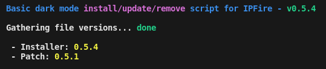
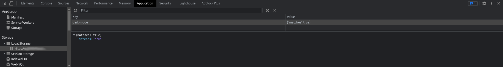
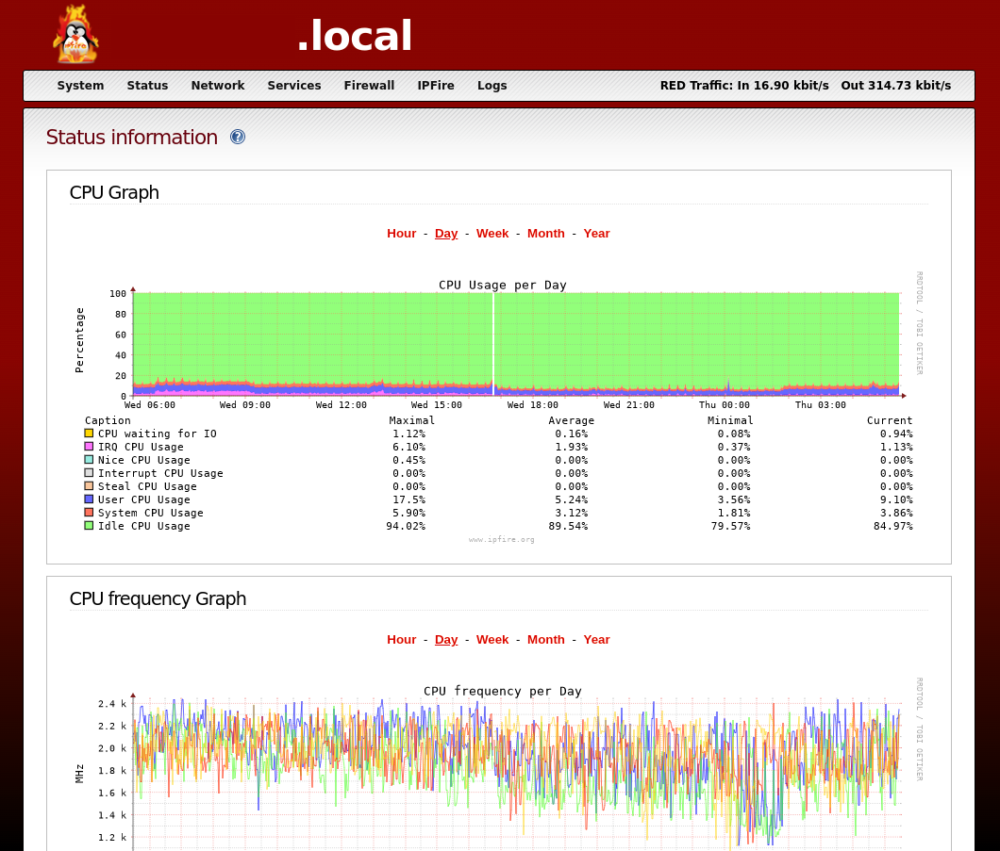
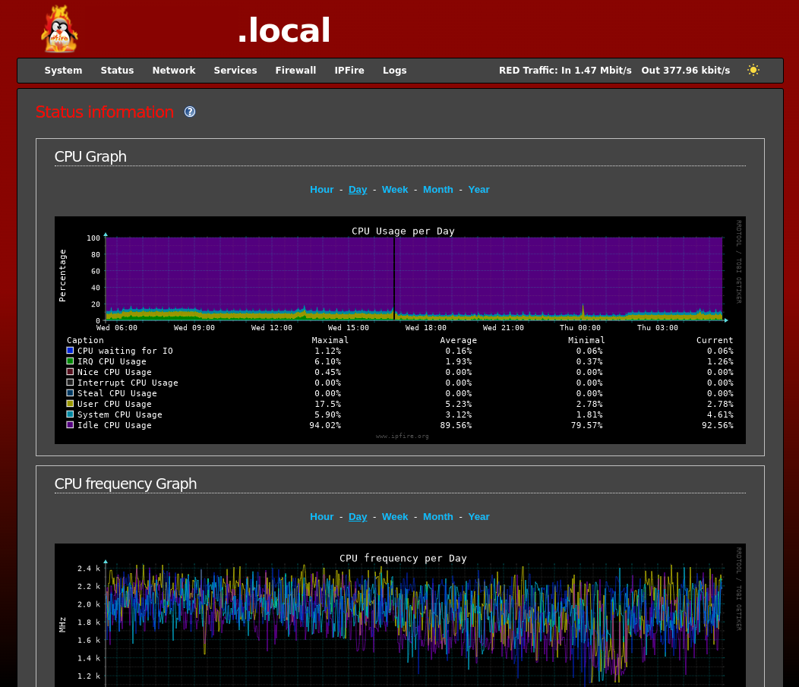

# IPFire dark theme <!-- omit from toc -->

Simple dark theme patch for the IPFire web interface.

## Current version <!-- omit from toc -->

The latest version is __`0.5.3`__ and __`0.5.8`__.

## Content <!-- omit from toc -->

* [How it works?](#how-it-works)
* [What it does exactly?](#what-it-does-exactly)
* [Is it safe to use?](#is-it-safe-to-use)
* [How to see if running the latest version?](#how-to-see-if-running-the-latest-version)
  * [From CLI](#from-cli)
  * [From files](#from-files)
  * [From the web console](#from-the-web-console)
* [Installation](#installation)
* [Usage](#usage)
  * [Update](#update)
  * [Uninstall](#uninstall)
  * [Reset](#reset)
* [Misc](#misc)
  * [Get versions of the files](#get-versions-of-the-files)
  * [Get latest changes in the project](#get-latest-changes-in-the-project)
  * [Run basic sanity check](#run-basic-sanity-check)
* [Screenshots](#screenshots)
  * [Before patch](#before-patch)
  * [After patch](#after-patch)
* [Roadmap](#roadmap)
* [Community](#community)
* [Contribute](#contribute)
  * [By creating / reporting new issues](#by-creating--reporting-new-issues)
  * [By submitting pull requests](#by-submitting-pull-requests)
* [Contributors](#contributors)
* [Author](#author)

---

## How it works?

The patch simply consist in two files:

1. [patch.js](patch.js) - Does the heavy work for setting up the dark theme
2. [patch.sh](patch.sh)
   * Patch the `functions.pl` file,
   * install the patch in the `include` folder
   * and rename the patch to `darkmode.js`

Once loaded, it will check if your environment is already configured in dark mode and load the required CSS code accordingly.

To provide a manual switch between light and dark modes, it also inject a selector next to the __RED__ traffic stats.

## What it does exactly?

What the patch does exactly is the following:

* Check if your environment is already configured in dark mode
* Target each DOM elements that needs to be styled differently
* Apply the dark theme CSS code on targetted DOM elements
* Store the user preference in the [localStorage](https://developer.mozilla.org/en-US/docs/Web/API/Window/localStorage)

The heavy work is mainly to find the right CSS selectors to use for targetting the DOM elements that needs to be styled. It was pretty easy for the generic part of the WUI but not really for the pages composed of tables.

> Please check the [roadmap](README.md#roadmap) to see if pages with tables are now fully supported or if the work is still in progress.

## Is it safe to use?

The project is written in pure Javascript and does not rely on any third party code or frameworks and does not load any external resources but it uses the [localStorage](https://developer.mozilla.org/en-US/docs/Web/API/Window/localStorage) feature supported by the modern browsers to store the theme preference. __If you have something against that, please don't use this project.__

> I totally understand that people can be against storing data in their browser space and will try to provide a better way to store theme preference in the next release.

## How to see if running the latest version?

As I had some difficulties to make a proper update process, it resulted in potentially broken updates or simply new releases not being installed correctly. Please, accept all my appologies for that. 🙇‍♂️

So to help users to find out if they are running the latest version, I'll describe here the whole process.

### From CLI

Go to the project folder and run the following command:

```console
# ./patch.sh -v
```

> You can also use `--version` if you prefer use explicit arguments.

You should get something similar:



### From files

1. Check for corresponding SRI hash in [patch.js.sri](patch.js.sri) and `patch.sh` line [#38](patch.sh#L38).
2. Check for corresponding SRI hash in `functions.pl`, you can see it from your browser in any page source code, the `<script></script>` line injected in the WUI can be found before the `</head>` tag:

    ```
    NPXhjUcE2TVeAAe/K1aXUbsrqRxnFfOsKD0lwB8KGzdTK36H3V3wS/tEp9+44OKGiTdzuq+SGqEjXrpWvycH2Q==
    ```

3. Check `patch.js` [version](patch.js#L5) and `patch.sh` [version](patch.sh#L7), both are respectively __`0.5.3`__ and __`0.5.8`__.

If you are running the latest version and still have nothing working on your side, please create a new [issue](https://github.com/Jiab77/ipfire-dark-theme/issues/new/choose) and I'll try my best to debug it.


### From the web console

Hit the <kbd>F12</kbd> key or <kbd>Ctrl</kbd> + <kbd>Shift</kbd> + <kbd>I</kbd> to open the web console.

You should see something like that:

```
Dark mode patch for IPFire loaded.

Version: 0.5.3
```

## Installation

1. Install `git` with __Pakfire__
2. Clone the project and run the patch:

```console
# pakfire install -y git
# git clone https://github.com/Jiab77/ipfire-dark-theme.git
# cd ipfire-dark-theme
# ./patch.sh
```

Once done, simply reload the page(s).

> You can remove `git` right after from __Pakfire__ once installed. `git` is just required for downloading and updating the project to get the latest versions.

## Usage

Once you've installed the patch, you should notice a new icon next to the __RED Traffic__ stats:


Just click on it and it will trigger the handler that will apply the dark theme and toggle the icon state:


The code should automatically detect if your environment is already configured in dark mode and apply the dark theme on page load but you can always click on the icon to switch between dark and light theme.

Your theme selection will be stored using the [localStorage](https://developer.mozilla.org/en-US/docs/Web/API/Window/localStorage) feature in `HTML5` supported by modern browsers:



> I initially wanted to use [sessionStorage](https://developer.mozilla.org/en-US/docs/Web/API/Window/sessionStorage) instead of [localStorage](https://developer.mozilla.org/en-US/docs/Web/API/Window/localStorage) but the user theme selection would have been lost once the tab or browser is closed and I wanted to make it the most convenient as possible for the users.
>
> I don't plan to store more than what you see on the screenshot but if you are annoyed or dislike that choice, please create an issue and I'll switch back to [sessionStorage](https://developer.mozilla.org/en-US/docs/Web/API/Window/sessionStorage).

### Update

Run the patch script with `-u`, it will then:

* Check if `git` is installed (*You can install it with __Pakfire__*)
* Get the latest version from github
* Compare local and latest versions
* Run the removal and install methods if necessary

```console
# cd ipfire-dark-theme
# ./patch.sh -u
```

> You can also use `--update` if you prefer the long version.

### Uninstall

Run the patch script with `-r`, it will then remove the installed patch.

```console
# cd ipfire-dark-theme
# ./patch.sh -r
```

> You can also use `--remove` if you prefer the long version.

### Reset

Run the patch script with `-R`, it will then remove and reinstall the patch.

```console
# cd ipfire-dark-theme
# ./patch.sh -R
```

> You can also use `--reset` if you prefer the long version.

## Misc

Few other features has been implemented in the patching script.

### Get versions of the files

```console
# cd ipfire-dark-theme
# ./patch.sh -v
```

> You can also use `--version` if you prefer the long version.

### Get latest changes in the project

```console
# cd ipfire-dark-theme
# ./patch.sh -c
```

> You can also use `--changelog` if you prefer the long version.

### Run basic sanity check

```console
# cd ipfire-dark-theme
# ./patch.sh -s
```

> You can also use `--sanity` if you prefer the long version.

## Screenshots

### Before patch



### After patch



## Roadmap

* [X] Create initial version
* [X] Add missing CSS code for tables
* [X] Avoid exposing sensible details about the WUI structure
* [X] Replace icons used by open source ones from [feather](https://github.com/feathericons/feather)
* [X] Improve the main README
* [X] Create an issue regarding the discovered table rendering bug
* [X] Implement `update` feature
* [X] Implement [SRI](https://developer.mozilla.org/en-US/docs/Web/Security/Subresource_Integrity)
* [X] Add strict type check on user stored preference value
* [X] Move the patching code to an [IIFE](https://en.wikipedia.org/wiki/Immediately_invoked_function_expression) to avoid polluting global scope
* [X] Implement `no-sri` feature
* [X] Implement `version` feature
* [X] Implement `changelog` feature
* [X] Implement `sanity` check feature
* [X] Implement `reset` feature
* [ ] Implement `solarized` theme
* [ ] Improve support for all `<table>` based pages (_almost done?_)
  * [ ] Improve support for `<table>` contents
* [ ] Improve support for all major browsers (_almost done?_)
* [ ] Apply to the IPFire developer guidelines and mailing lists (_process started_)
* [ ] ~~Package and distribute the code as an [add-on](https://wiki.ipfire.org/devel/ipfire-2-x/addon-howto)~~ (_might be not necessary_)
* [ ] Find a way to add my code in the core project
* [ ] Make it persistent across updates

## Community

You can find the discussion around this project [here](https://community.ipfire.org/t/missing-dark-mode/9132).

## Contribute

There is at least two ways to contribute to this project. I'll try to describe them below.

### By creating / reporting new issues

If you fins something that gets difficult to read when the Dark Theme is enabled, please join the [discussion](https://community.ipfire.org/t/missing-dark-mode/9132) or create a new [issue](https://github.com/Jiab77/ipfire-dark-theme/issues/new/choose).

### By submitting pull requests

The `main` branch is protected by some security rules:

* Contributors must sign their commits with their GPG key
  * __All unsigned commits will be automatically rejected.__
* The above rule can't be bypassed

Here is the development flow / method that you must follow:

* Make 2 test VMs (dev / prod)
* Work only from the latest version
* Clone the project and run the [install script](patch.sh) with the `--no-sri` argument
* When you've finished your tests and are ready to push your code:
  * Increment version number in [patch.js](patch.js)
  * Run the [gen-sri.sh](tools/gen-sri.sh) script
    * `./tools/gen-sri.sh patch.js -s`
  * Update the [install script](patch.sh) and this [README](README.md) with the newly generated SRI hash
  * Increment version number in [patch.sh](patch.sh)

> I'm not sure to be very clear in this part as I'm not very used to that yet :sweat_smile: so please bear with me :grin:
>
> I'll to make it better as soon as I can.

## Contributors

I'd like to give huge thanks for these people from the [IPFire](https://www.ipfire.org/) community who helped me a lot to improve this project and make it as good as it is now. :bowing_man:

<table>
  <tr>
  <td align="center"><strong>Nickname</strong></td>
  <td align="center"><strong>Contribution</strong></td>
  </tr>
  <tr>
    <td align="center"><code>@bonnietwin</code></td>
    <td>For the introduction to the community and help on the understanding of the developers guidelines and way to do things</td>
  </tr>
  <tr>
    <td align="center"><code>@cfusco</code></td>
    <td>For his very good security advices and his shared web development interest</td>
  </tr>
  <tr>
    <td align="center"><code>@luani</code></td>
    <td>For his care and interest into the project development</td>
  </tr>
  <tr>
    <td align="center"><code>@sec-con</code></td>
    <td>For his care about security and portability aspects in the project</td>
  </tr>
  <tr>
    <td align="center">
      <code>@roberto</code>,
      <code>@mumpitz</code>,
      <code>@siosios</code>,
      <code>@experimental</code>,
      <code>@tphz</code>,
      <code>@ummeegge</code>
    </td>
    <td>For their extensive and detailed issues reporting and testing</td>
  </tr>
  <tr>
    <td colspan="2" align="center"><strong>And all others who gave a try and appreciated my work</strong></td>
  </tr>
</table>

> Hope to not have forgotten anyone but if so, please let me know and I'll add you. :wink:

## Author

* __Jiab77__
